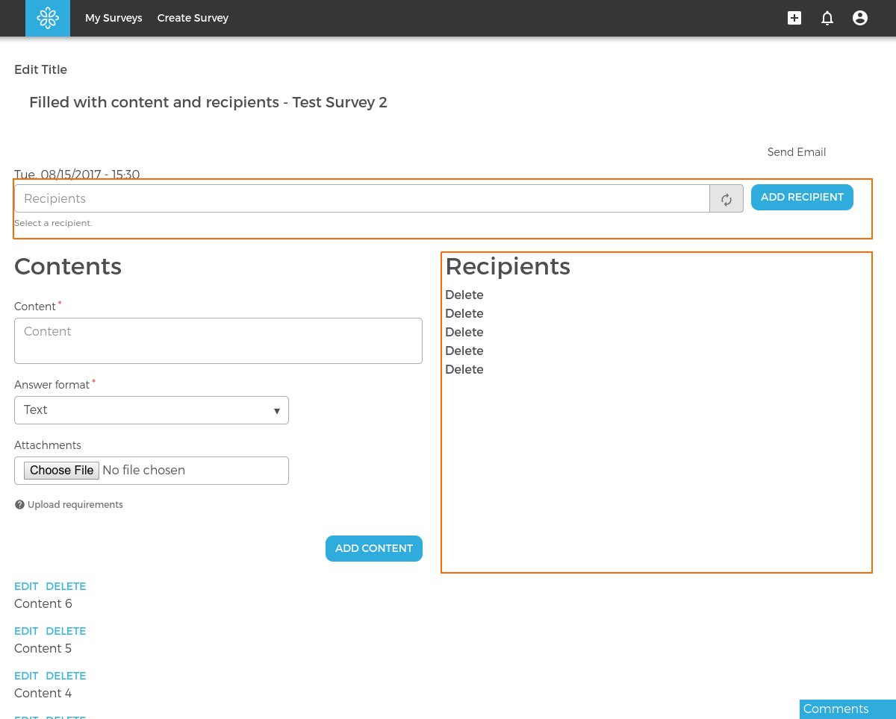

# Mailing List Recipients

All related code should be placed in [dmt_mailing_list_recipients](../../modules/custom/dmt_mailing_list/modules/dmt_mailing_list_recipients/dmt_mailing_list_recipients.info.yml) module.
Module handles ui elements and business logic for adding/removing recipients to the [mailing list](mailing_list.md).

#### Module defines:

- [Recipients](../../modules/custom/dmt_mailing_list/modules/dmt_mailing_list_recipients/src/Recipients.php) service.

- [RecipientsForm Block](../../modules/custom/dmt_mailing_list/modules/dmt_mailing_list_recipients/src/Plugin/Block/RecipientsFormBlock.php) which contains
[Recipients Form](../../modules/custom/dmt_mailing_list/modules/dmt_mailing_list_recipients/src/Form/RecipientsForm.php) which has two elements
recipient auto complete field and submit button. Block is added to the mailing list view mode via panelizer.

- [Recipients Delete Link](../../modules/custom/dmt_mailing_list/modules/dmt_mailing_list_recipients/src/Plugin/views/field/RecipientDeleteLink.php) field for views and
[Recipients Controller](../../modules/custom/dmt_mailing_list/modules/dmt_mailing_list_recipients/src/Controller/RecipientsController.php) and 
[Route](../../modules/custom/dmt_mailing_list/modules/dmt_mailing_list_recipients/dmt_mailing_list_recipients.routing.yml) for delete link. 
 
 

