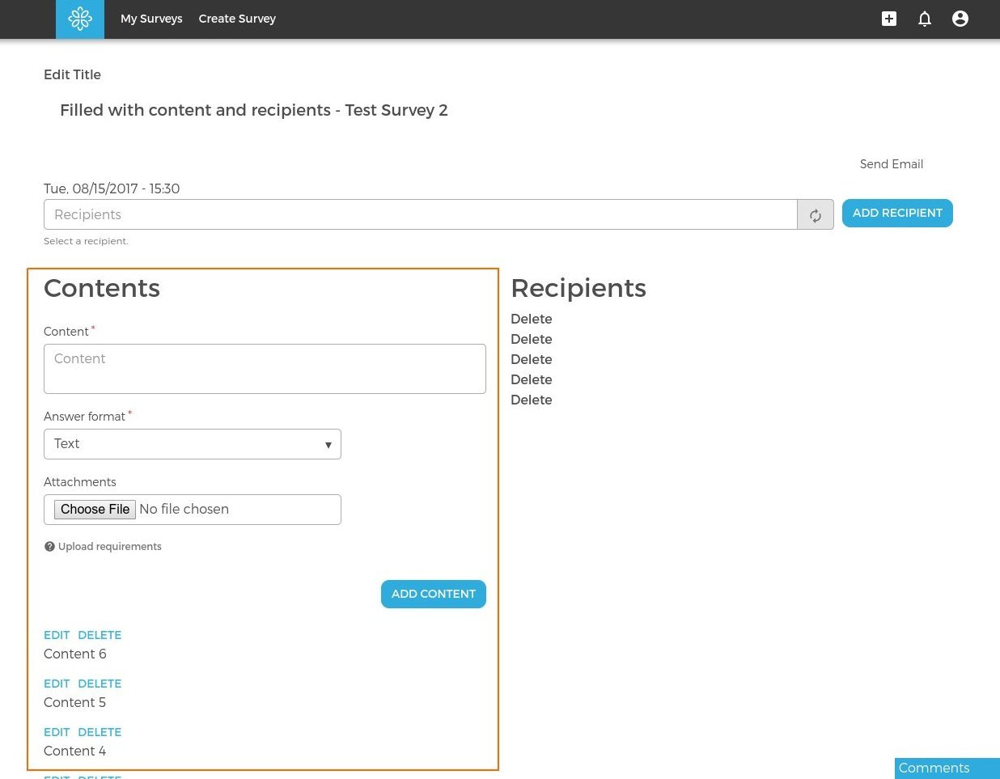

## Content

All related code should be placed in [dmt_content](../../../modules/custom/dmt_content/dmt_content.module) module.

#### Content is a bundle of node entity (Content type). 

**Fields:**

- Title
  - Title is hidden and it is generated in presave hook in [dmt_content](../../../modules/custom/dmt_content/dmt_content.module) module
- Content type
  - Currently missing field that should be choice field with options like:
    - Question
    - Issue
    - Story
- Content (body)
- Answer format
  - Current options:
    - Text
    - Numeric
    - Yes/No/Sustain
- Attachments
  - File attachments
    - We need to configure attachment types here 
    - We send these in email    
- Answers
  - Field that references [comments](answer_comment.md) (answer, activity)
  
**Views:**
- [Mailing list items](http://local.dv.com/admin/structure/views/view/mailing_list_items)
  - is used to show questions in Figure 1
    

